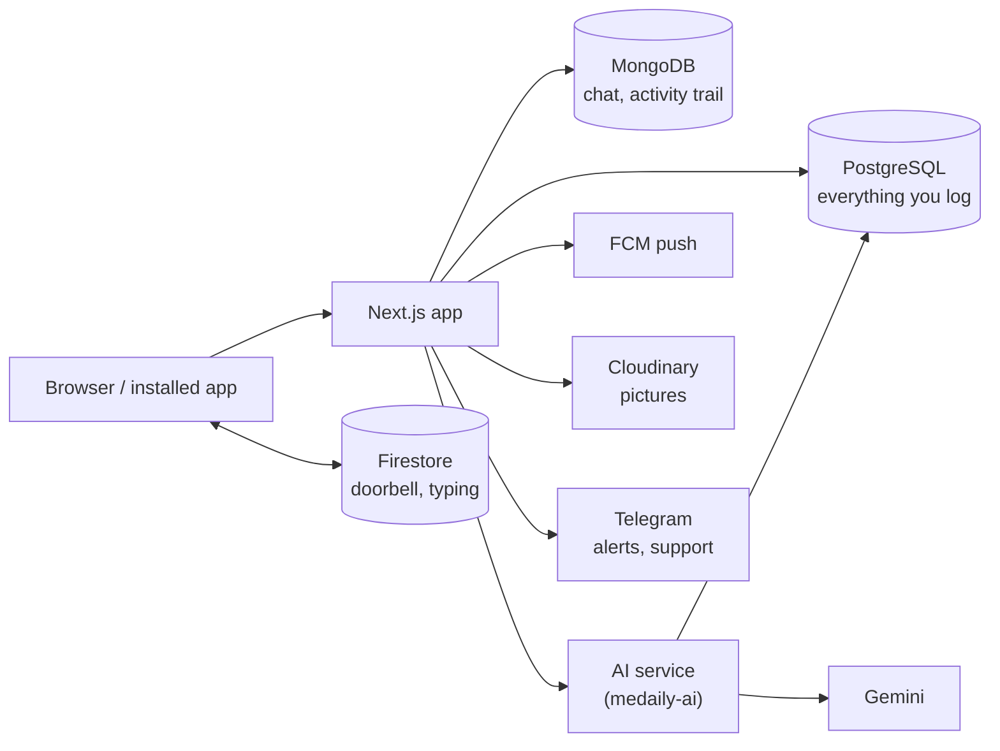

# medaily documentation

medaily is a personal life-tracking app: one daily log, and everything else
built from it. Nothing is required — the daily loop works on its own, and
every other module is there when it earns its place.

These documents are written for two readers at once. **Business analysts**
will find what each feature does, the rules it follows and how features affect
one another. **Engineers** will find the same pages carry the mechanism, and
the [Reference](#reference) section holds the data model, live updates and the
AI service.

## Two ideas behind the design

**The daily log records the past. Plans live elsewhere.** The daily log never
holds intent; that is what the [Calendar](features/calendar.md)'s day view,
planned blocks and tasks are for. Mixing them would mean "what I meant to do"
and "what I did" could never be compared.

**A fact is entered once.** A timed session becomes the day's study minutes. A
habit bound to a metric ticks itself. A project's time spent is the sum of the
sessions attributed to it. Nothing asks twice. That is why most feature pages
end with a long **Related** list: features feed each other rather than keep
copies.

## How these documents are organised

| Section | Read it to learn | Start with |
| --- | --- | --- |
| **Get started** | Signing in, the first days, finding your way around | [Sign in](get-started/sign-in.md) |
| **Features** | One page per feature: what it does, its rules, how to use it, what it affects | [Daily log](features/daily-log.md) |
| **Operations** | Configuration, scheduled jobs, this documentation site | [Configuration](operations/configuration.md) |
| **Reference** | Tables and collections, live updates, the AI service | [Data model](reference/data-model/overview.md) |
| **Changelog** | What changed in these documents, and when | [Changelog](CHANGELOG.md) |

Every feature page follows the same shape: a one-paragraph summary, an
at-a-glance table (where it lives, whether it works offline, what it needs),
**Rules**, task-by-task steps, **How it works**, **Limits**, and **Related**.

## Architecture at a glance



Only PostgreSQL is required. Each of the others switches a feature on, and the
app hides that feature rather than breaking when it is missing — see
[Configuration](operations/configuration.md).

## Reference

- [Data model](reference/data-model/overview.md) — every Postgres table and
  Mongo collection, column by column
- [Live updates](reference/realtime/overview.md) — how a message reaches
  another screen, the typing indicator, push notifications, and what Firestore
  holds
- [AI service](reference/ai-service/overview.md) — the separate service behind
  the assistant and the written summaries

## Keeping them honest

Documentation that drifts is worse than none: it is read with the same trust
and answers with yesterday's facts.

**When a change adds or removes something a person can see or do, update that
feature's page** under `features/`, and the **Related** list of every page it
affects. The test is whether the steps still work if followed literally.

**When a change touches `drizzle/`, update the matching page under
[reference/data-model/](reference/data-model/overview.md) in the same
commit.** A migration that ships without the document leaves a column nobody
can explain six months later.

**When a change touches what a Mongo collection holds, update
[Activity trail](reference/data-model/activity-trail.md) or
[Chat data](reference/data-model/chat.md).** Those collections have no
migration file — they are made on first use — so the document is the only
record that the shape was ever decided rather than stumbled into.

**When a change touches `src/lib/realtime/**`, `firestore.rules` or push,
update [Live updates](reference/realtime/overview.md).** It is the only place
the reasoning behind the rules is written down, and rules that deny fail
silently — a wrong document there costs an afternoon.

**When a change touches the `medaily-ai` repository or how the app calls it,
update [AI service](reference/ai-service/overview.md).**

Either way, add a dated line to the [Changelog](CHANGELOG.md), then run
`bun run docs:build` and commit `public/docs` — see
[Documentation site](operations/docs-site.md).

To read the live schema rather than trusting the document:

```bash
psql "$DATABASE_URL" -c '\d+ daily_logs'
```
