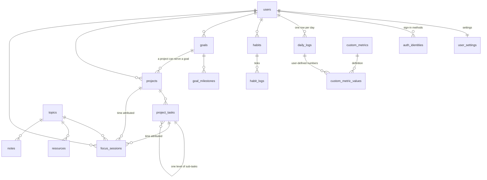

# Database

PostgreSQL, 46 tables, one Drizzle schema file per module under
`src/lib/db/schema/`. Migrations live in `drizzle/` and are applied with
`pnpm db:migrate` — never automatically, and never after the code that needs
them (see the deploy rule in `CLAUDE.md`).

## Conventions

These repeat on almost every table and are not described again below.

| Column | Meaning |
| --- | --- |
| `id` | `uuid`, primary key, `gen_random_uuid()` |
| `user_id` | `uuid` → `users.id`, `ON DELETE CASCADE`. **Every repository query filters on it.** Deleting the user deletes everything they own |
| `created_at` / `updated_at` | `timestamptz`, default `now()`. `updated_at` is set by the repository on write, not by a trigger |
| `archived_at` | `timestamptz` nullable. Non-null means hidden from lists but still joinable, so history stays readable. Rows are archived, not deleted |
| `note` / `notes` | free text the user writes; never parsed |
| `sort_order` | `integer`, manual ordering inside a list |

Dates use `date` (no timezone) for anything the user thinks of as a day, and
`timestamptz` for machine instants. The difference matters: the app has a
configurable **day rollover hour**, so "today" is not midnight.

## Map

Finance, health, knowledge, people and reviews hang off `users` the same way
and are shown in their own sections.

## Core

### `users`

The account. One row per person; the app was single-user first, so a fixed
owner id is seeded by migration and still owns everything written then.

| Column | Type | Notes |
| --- | --- | --- |
| `display_name` | text, not null | Defaults to `'Me'` |
| `email` | text | From the Google profile; unique where present |
| `image_url` | text | Google avatar |

### `user_settings`

One row per user, created on first use. Everything the app reads before it can
render: the clock, the palette, the maths.

| Column | Type | Notes |
| --- | --- | --- |
| `locale` | enum `en`/`vi` | Mirrored into a cookie so the first server render is already right |
| `timezone` | text | Default `Asia/Ho_Chi_Minh` |
| `day_rollover_hour` | smallint | Default `4`. A log written at 01:00 belongs to the previous day — this is why |
| `week_start` | enum `monday`/`sunday` | Drives every weekly range |
| `theme` | text | Free text validated against the registry in `lib/themes.ts`, so a new theme needs no migration |
| `density`, `accent` | text | Presentation only |
| `unit_system` | enum `metric`/`imperial` | |
| `default_currency` | text | Default `VND` |
| `score_weights`, `score_targets` | jsonb | Merged **over** the defaults on read, so a partially written blob can never produce an undefined target |
| `streak_thresholds` | jsonb | What counts as "done" for a streak, per metric |
| `streak_grace_enabled` | boolean | One missed day does not break a streak |
| `insight_thresholds` | jsonb | When a rule-generated observation is worth showing |
| `reminder_time` | time | Default `21:00` |
| `notification_prefs`, `dashboard_cards` | jsonb | |
| `onboarding` | jsonb | Only `tourSeenAt` and `checklistDismissedAt`. Progress itself is derived from real rows, so the checklist cannot claim something the database does not contain |
| `shortcuts` | jsonb | **Only the keys the user changed**; the rest come from the registry, so a default can change later for everyone who never touched it |

### `auth_identities`

How a user signs in. A user can hold several.

| Column | Type | Notes |
| --- | --- | --- |
| `provider` | enum | `password` (the env credential pair) or `google` |
| `provider_uid` | text | Unique with `provider`. The Firebase uid, or the username |
| `email` | text | As the provider reported it |
| `last_login_at` | timestamptz | |

## The daily log

### `daily_logs`

One row per user per day — the spine of the app. **Past-only**: it records
what happened, never what is planned. Intent lives in `planned_blocks` and
`project_tasks`.

| Column | Type | Notes |
| --- | --- | --- |
| `log_date` | date, not null | Unique with `user_id`. The *logical* day, after rollover |
| `energy`, `mood` | smallint | 1–10 |
| `sleep_hours` | numeric(3,1) | |
| `bedtime`, `wake_time` | time | |
| `technical_study_minutes` | smallint | May be superseded by timed sessions — see `v_daily_effective` |
| `deep_work_minutes` | smallint | Same |
| `exercise_minutes`, `exercise_type` | smallint, text | |
| `reading_minutes`, `reading_pages` | smallint | |
| `entertainment_minutes`, `english_minutes` | smallint | |
| `daily_win`, `daily_problem` | text | Seeded into the period review as suggestions |
| `tomorrow_priority` | text | Shown on the **Today** page the next day |
| `note` | text | |
| `source` | enum `log_source` | `manual`, `catch_up` or `import`. The enum is shared with `habit_logs`, which also uses `derived` |

Every metric column is nullable on purpose: **null is "not recorded", not
zero**, and averages must not treat a blank day as a zero day.

### `custom_metrics` / `custom_metric_values`

Activities the user added themselves, so the fixed columns above are not the
ceiling.

`custom_metrics` — the definition:

| Column | Type | Notes |
| --- | --- | --- |
| `key` | text, not null | What a habit or a goal binds to. Lowercase slug, proposed from the English name but editable, and never one of the built-in metric names |
| `label_en`, `label_vi` | text, not null | Shown per locale |
| `type` | enum | `number`, `duration`, `boolean`, `scale`, `text` — decides which input the daily log renders. `duration` is minutes, and is the only kind the timer offers to run |
| `unit` | text | Display only. No conversion, no maths |
| `min`, `max` | numeric | Bounds for the stepper |
| `aggregation` | enum | How a goal totals it: `sum`, `avg`, `count_days`, `latest` |

`custom_metric_values` — one value per day per metric. Primary key is
`(daily_log_id, custom_metric_id)`; there is no `id`.

| Column | Type | Notes |
| --- | --- | --- |
| `value_numeric` / `value_bool` / `value_text` | | Exactly one is non-null, enforced by a `CHECK`. Which one depends on the metric's `type` |

### `v_daily_effective` (view)

Not a table. Resolves `technical_study_minutes` and `deep_work_minutes`
against timed `focus_sessions`, so a number typed by hand and a number counted
by the timer can never disagree. Habits, goals, streaks, the score and
analytics all read the view, not the raw columns.

## Habits and goals

### `habits`

| Column | Type | Notes |
| --- | --- | --- |
| `frequency_type` | enum | `daily`, `weekly`, `weekdays`, `interval` |
| `target_count` | smallint | Times per period |
| `weekdays` | array | For `weekdays` |
| `interval_days` | smallint | For `interval` |
| `linked_metric` | text | A metric key — built-in **or** a `custom_metrics.key` |
| `linked_operator` | enum | `gte`, `lte`, `eq` … |
| `linked_threshold` | numeric | "sleep ≥ 7" ticks itself from the log, so the same fact is never entered twice |
| `start_date`, `end_date` | date | |

### `habit_logs`

| Column | Type | Notes |
| --- | --- | --- |
| `log_date` | date | Unique with `habit_id` |
| `count`, `completed` | smallint, boolean | |
| `source` | enum `log_source` | `manual`, or `derived` when the tick came from the daily log |

A derived tick is **deleted** when the condition stops holding, not set to
false — "not done" and "never ticked" must stay indistinguishable for
completion-rate maths.

### `goals` / `goal_milestones`

| Column | Type | Notes |
| --- | --- | --- |
| `progress_mode` | enum | `manual`, `metric` or `milestones` |
| `progress_manual` | numeric | 0–100, for `manual` |
| `metric_key` | text | Built-in or custom |
| `metric_aggregation` | enum | `sum`, `avg`, `count_days`, `latest` |
| `metric_period` | enum | The window the target applies to |
| `metric_target` | numeric | |
| `metric_direction` | enum | `at_least` or `at_most` |
| `goal_milestones.weight` | numeric | Milestones contribute proportionally, not equally |

## Work and time

### `projects` / `project_tasks`

| Column | Type | Notes |
| --- | --- | --- |
| `projects.goal_id` | uuid | A project can serve a goal |
| `project_tasks.project_id` | uuid, **nullable** | Null means a standalone task — "call mum" needs no project |
| `project_tasks.parent_task_id` | uuid | One level only; deeper trees turn a personal tool into Jira |
| `project_tasks.status` | enum | `todo`, `doing`, `blocked`, `done` |
| `project_tasks.due_date` | date | What the **Today** page filters on |
| `project_tasks.estimate_minutes` | smallint | |
| `project_tasks.completed_at` | timestamptz | Follows `status` |

### `focus_sessions`

Timed work. One shape records learning, deep work and project time, so one
query path serves them all.

| Column | Type | Notes |
| --- | --- | --- |
| `session_date` | date | The rollover-aware logical day, which keeps the join to `v_daily_effective` free of timezone maths |
| `minutes` | smallint, not null | 1–1440 |
| `kind` | enum | `learning`, `deep_work`, `project` |
| `topic_id`, `project_id`, `task_id` | uuid | Attribution. This is what makes a project's "time spent" derivable rather than typed |
| `source` | enum | `manual` or `timer` |

### `timer_state`

At most one running timer per user — `user_id` is the primary key.

| Column | Type | Notes |
| --- | --- | --- |
| `started_at` | timestamptz | Start of the current stretch, not of the whole run |
| `paused_at` | timestamptz | Non-null while paused |
| `accumulated_seconds` | integer | Time banked before the current stretch, so pausing does not lose it |
| `mode` | enum | `stopwatch` or `countdown` |
| `target_seconds` | integer | For `countdown` |
| `target` | enum | `focus` or `workout` — decides which table the finished run writes to |
| `workout_type`, `activity` | text | |

### `planned_blocks`

Time blocking. **This is where forward-looking intent lives**, since daily
logs are past-only, and it is what "plan vs actual" compares against.

| Column | Type | Notes |
| --- | --- | --- |
| `block_date`, `start_time`, `end_time` | | `end_time > start_time`, enforced by a `CHECK` |
| `kind` | enum | `learning`, `deep_work`, `project`, `exercise`, `other` |
| `project_id`, `task_id`, `topic_id` | uuid | What the block is for |

### `events`

Calendar entries, exported one-way as ICS.

| Column | Type | Notes |
| --- | --- | --- |
| `starts_at`, `ends_at` | timestamptz | |
| `all_day` | boolean | Changes how the ICS line is written |
| `recurrence_rule`, `recurrence_until` | enum, date | Expanded in `lib/planning/recurrence.ts`; a monthly event skips months without the day rather than sliding |

### `reminders`

One reminders table serves every module.

| Column | Type | Notes |
| --- | --- | --- |
| `due_on` | date, not null | |
| `recurrence` | enum | |
| `person_id` | uuid | Set when it is about someone |
| `entity_type`, `entity_id` | text, uuid | A loose pointer at anything else. Deliberately not a foreign key |
| `done_at`, `snoozed_until` | | |

## Learning and knowledge

| Table | Columns worth knowing |
| --- | --- |
| `topics` | `name`, `category`, `parent_id` (one hierarchy for study subjects) |
| `resources` | `type` (book, course, video…), `status` (`backlog`, `in_progress`, `done`, `dropped`), `progress_percent`, `rating`, `topic_id` |
| `notes` | `body_md` Markdown, `type` (`note`, `concept`, `bookmark`, `lesson`), `topic_id`, `resource_id`, `learned_on` (the day a lesson was learned, not typed), `search_tsv` |
| `note_links` | `source_note_id` → `target_note_id`, plus `target_title` so a `[[wiki link]]` to a note that does not exist yet is kept, not dropped |
| `tags` / `note_tags` | Free-form tags. A lesson's **place** — home, office — is a tag, not a column, because places change and a tag costs no migration |
| `journal_entries` | `entry_date`, `body_md`, `mood`, `tags`, `search_tsv` |

`search_tsv` is maintained by a trigger (see `drizzle/views.sql`) rather than
a generated column, because the diacritic-folding function has to exist before
the column that uses it — and migrations run before that SQL.

## Finance

| Table | Columns worth knowing |
| --- | --- |
| `accounts` | `type` (cash, bank, credit_card, e_wallet, investment, loan), `currency`, `opening_balance` |
| `finance_categories` | `kind` (`income`/`expense`), `parent_id` |
| `transactions` | `kind` (`income`/`expense`/`transfer`), `account_id`, `counter_account_id` (the other side of a transfer), `category_id`, `fx_rate`, `merchant`, `tags` |
| `recurring_transactions` | `rule`, `next_due_on`, `ends_on` |
| `budgets` | `category_id` + `period_start` + `amount`, unique per user. `rollover` carries an unspent remainder |
| `assets` | `kind` (`asset`/`liability`), `value`, `as_of` |
| `investments` | `symbol`, `quantity`, `avg_cost`, `last_price` — prices are typed by hand; the app fetches no market data |

Balances come from the `v_account_balances` view, so the arithmetic lives in
one place.

## Health

| Table | Columns worth knowing |
| --- | --- |
| `workouts` | `performed_on`, `type`, `duration_minutes`, `distance_km`, `rpe` |
| `workout_sets` | `workout_id`, `exercise`, `sets`, `reps`, `weight_kg`, `rest_seconds` |
| `body_measurements` | `measured_on`, `weight_kg`, `body_fat_pct`, `waist_cm`, `resting_hr`, `blood_pressure` |
| `nutrition_logs` | `log_date`, `calories`, `protein_g`, `carbs_g`, `fat_g`, `water_ml` |

## People

| Table | Columns worth knowing |
| --- | --- |
| `people` | `relationship`, `company`, `birthday`, `contact_interval_days` (the desired cadence — anyone past it appears in "reach out") |
| `interactions` | `person_id`, `occurred_on`, `channel`, `summary` |
| `person_photos` | `public_id` (the Cloudinary handle, unique per user), `format`, `width`, `height`, `bytes`, `caption`, `taken_on`. The file lives on Cloudinary; only what is needed to build a URL is stored |

## Reviews and generated output

`weekly_reviews`, `monthly_reviews` and `yearly_reviews` share one shape,
differing only in the period column (`week_start_date`, `month_start_date`,
`year`), each unique per user.

| Column | Type | Notes |
| --- | --- | --- |
| `what_worked`, `what_didnt`, `change_next`, `top_priority`, `reflection` | text | |
| `metrics_snapshot` | jsonb | Frozen on finalise, so a review read a year later shows what it showed then |
| `snapshot_version` | integer | |
| `finalized_at` | timestamptz | Null means a draft, which recomputes from raw logs every time it is opened |

| Table | Columns worth knowing |
| --- | --- |
| `insights` | `kind`, `severity`, `payload` jsonb, `dedupe_key` (so the same observation is not raised twice), `dismissed_at`, `snoozed_until` |
| `ai_reports` | `kind`, `period_start`/`period_end`, `question`, `model`, `prompt_version`, `content_md`. The model and prompt version are stored so an old report can be read in context |
