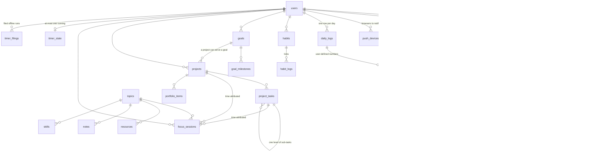

# Database

PostgreSQL, 47 tables and two views, one Drizzle schema file per module under
`src/lib/db/schema/`. Migrations live in `drizzle/` and are applied with
`pnpm db:migrate` — never automatically, and never after the code that needs
them (see the deploy rule in `CLAUDE.md`).

`scripts/migrate.ts` runs the numbered migrations first and then re-applies
`drizzle/views.sql` on every run. That file is idempotent and holds what a
migration cannot express well, or what has to exist after every migration: the
two views, the `updated_at` and search triggers, the `unaccent` extension, and
the owner row.

## Conventions

These repeat on almost every table and are not described again below.

| Column | Meaning |
| --- | --- |
| `id` | `uuid`, primary key, `gen_random_uuid()` |
| `user_id` | `uuid` → `users.id`, `ON DELETE CASCADE`. **Every repository query filters on it.** Deleting the user deletes everything they own |
| `created_at` / `updated_at` | `timestamptz`, default `now()`. `updated_at` is kept by a `BEFORE UPDATE` trigger (`set_updated_at()`, installed by `drizzle/views.sql` on every table that has the column), so a write that forgets it is still stamped. Some repositories also set it explicitly; the trigger wins either way |
| `archived_at` | `timestamptz` nullable. Non-null means hidden from lists but still joinable, so history stays readable. Rows are archived, not deleted |
| `note` / `notes` | free text the user writes; never parsed |
| `sort_order` | `integer`, manual ordering inside a list |

Dates use `date` (no timezone) for anything the user thinks of as a day, and
`timestamptz` for machine instants. The difference matters: the app has a
configurable **day rollover hour**, so "today" is not midnight.

## Map

```mermaid
erDiagram
    users ||--|| user_settings : "settings"
    users ||--o{ auth_identities : "sign-in methods"
    users ||--o{ push_devices : "browsers to notify"
    users ||--o{ daily_logs : "one row per day"
    users ||--o{ habits : ""
    users ||--o{ goals : ""
    users ||--o{ projects : ""
    users ||--o{ focus_sessions : ""
    users ||--o| timer_state : "at most one running"
    users ||--o{ timer_filings : "filed offline runs"

    daily_logs ||--o{ custom_metric_values : "user-defined numbers"
    custom_metrics ||--o{ custom_metric_values : "definition"

    habits ||--o{ habit_logs : "ticks"
    goals ||--o{ goal_milestones : ""
    goals ||--o{ projects : "a project can serve a goal"

    projects ||--o{ project_tasks : ""
    project_tasks ||--o{ project_tasks : "one level of sub-tasks"
    project_tasks ||--o{ focus_sessions : "time attributed"
    projects ||--o{ focus_sessions : "time attributed"
    topics ||--o{ focus_sessions : ""
    topics ||--o{ resources : ""
    topics ||--o{ notes : ""
    topics ||--o{ skills : ""
    projects ||--o{ portfolio_items : ""

    people ||--o{ transactions : "debt or payee"
    accounts ||--o{ transactions : ""
```

Finance, health, knowledge, people, career and reviews hang off `users` the
same way and are shown in their own sections.

## Core

### `users`

The account. One row per person; the app was single-user first, so a fixed
owner id (`00000000-0000-4000-8000-000000000001`, with its `user_settings`
row) is inserted by `drizzle/views.sql` after every migration run — `ON
CONFLICT DO NOTHING`, so it is never duplicated — and still owns everything
written then.

| Column | Type | Notes |
| --- | --- | --- |
| `display_name` | text, not null | Defaults to `'Me'` |
| `email` | text | From the Google profile; unique case-insensitively (`lower(email)`) where present. The owner row has none |
| `image_url` | text | Google avatar |

### `user_settings`

One row per user, created on first use. Everything the app reads before it can
render: the clock, the palette, the maths.

| Column | Type | Notes |
| --- | --- | --- |
| `locale` | enum `en`/`vi` | Mirrored into a cookie so the first server render is already right |
| `timezone` | text | Default `Asia/Ho_Chi_Minh` |
| `day_rollover_hour` | smallint | Default `4`. A log written at 01:00 belongs to the previous day — this is why |
| `week_start` | enum `monday`/`sunday` | Drives every weekly range |
| `theme` | text | Free text validated against the registry in `lib/themes.ts`, so a new theme needs no migration |
| `density`, `accent` | text | Presentation only |
| `unit_system` | enum `metric`/`imperial` | |
| `default_currency` | text | Default `VND` |
| `score_weights`, `score_targets` | jsonb | Merged **over** the defaults on read, so a partially written blob can never produce an undefined target |
| `streak_thresholds` | jsonb | What counts as "done" for a streak, per metric |
| `streak_grace_enabled` | boolean | One missed day does not break a streak |
| `insight_thresholds` | jsonb | When a rule-generated observation is worth showing |
| `reminder_time` | time | Default `21:00` |
| `notification_prefs`, `dashboard_cards` | jsonb | |
| `hidden_daily_fields` | jsonb | Daily-log fields the form stops asking for (`0017`). **Hidden, never deleted**: the column and its history stay, the field is just not offered |
| `onboarding` | jsonb | Only `tourSeenAt` and `checklistDismissedAt`. Progress itself is derived from real rows, so the checklist cannot claim something the database does not contain |
| `shortcuts` | jsonb | **Only the keys the user changed**; the rest come from the registry, so a default can change later for everyone who never touched it |

### `auth_identities`

How a user signs in. A user can hold several.

| Column | Type | Notes |
| --- | --- | --- |
| `provider` | enum | `password` (the env credential pair) or `google` |
| `provider_uid` | text | Unique with `provider`. The Firebase uid, or the username |
| `email` | text | As the provider reported it |
| `last_login_at` | timestamptz | |

### `push_devices`

Where a person's notifications can reach them. One row per browser that asked
for them — a phone and a laptop are two.

Keyed by the **token**, not by `(user_id, token)`. FCM hands the same string
back to whoever registers the same browser, so after a sign-out and a sign-in
by somebody else the row has to change owner rather than be joined by a second
one; getting that wrong sends one person's notifications to the other's phone.

Cascades with the user, which is what keeps account removal from having to
remember it.

| Column | Type | Notes |
| --- | --- | --- |
| `token` | text, not null | Unique. The FCM registration token — the address |
| `user_agent` | text | Only to tell two rows apart; never trusted |
| `last_seen_at` | timestamptz | Moved forward each time the browser confirms the token |

## The daily log

### `daily_logs`

One row per user per day — the spine of the app. **Past-only**: it records
what happened, never what is planned. Intent lives in `planned_blocks` and
`project_tasks`.

| Column | Type | Notes |
| --- | --- | --- |
| `log_date` | date, not null | Unique with `user_id`. The *logical* day, after rollover |
| `energy`, `mood` | smallint | 1–10 |
| `sleep_hours` | numeric(3,1) | |
| `bedtime`, `wake_time` | time | |
| `technical_study_minutes` | smallint | May be superseded by timed sessions — see `v_daily_effective` |
| `deep_work_minutes` | smallint | Same |
| `exercise_minutes`, `exercise_type` | smallint, text | |
| `reading_minutes`, `reading_pages` | smallint | |
| `entertainment_minutes`, `english_minutes` | smallint | |
| `daily_win`, `daily_problem` | text | Seeded into the period review as suggestions |
| `tomorrow_priority` | text | Shown on the **Today** page the next day |
| `note` | text | |
| `source` | enum `log_source` | `manual`, `catch_up` or `import`. The enum is shared with `habit_logs`, which also uses `derived` |

Every metric column is nullable on purpose: **null is "not recorded", not
zero**, and averages must not treat a blank day as a zero day. `CHECK`s hold
each value in range (1–10, 0–24 hours, 0–1440 minutes), and `no_future_log`
refuses a `log_date` later than `CURRENT_DATE + 1` — the extra day tolerates
clock skew between the app server and the database, not planning ahead.

### `custom_metrics` / `custom_metric_values`

Activities the user added themselves, so the fixed columns above are not the
ceiling.

`custom_metrics` — the definition:

| Column | Type | Notes |
| --- | --- | --- |
| `key` | text, not null | What a habit or a goal binds to. Unique with `user_id`. Lowercase slug, proposed from the English name but editable, and never one of the built-in metric names |
| `label_en`, `label_vi` | text, not null | Shown per locale |
| `type` | enum | `number`, `duration`, `boolean`, `scale`, `text` — decides which input the daily log renders. `duration` is minutes, and is the only kind the timer offers to run |
| `unit` | text | Display only. No conversion, no maths |
| `min`, `max` | numeric | Bounds for the stepper |
| `aggregation` | enum | How a goal totals it: `sum`, `avg`, `count_days`, `latest` |

`custom_metric_values` — one value per day per metric. Primary key is
`(daily_log_id, custom_metric_id)`; there is no `id`.

| Column | Type | Notes |
| --- | --- | --- |
| `value_numeric` / `value_bool` / `value_text` | | Exactly one is non-null, enforced by a `CHECK`. Which one depends on the metric's `type` |

### `v_daily_effective` (view)

Not a table. Resolves `technical_study_minutes` and `deep_work_minutes`
against timed `focus_sessions`, so a number typed by hand and a number counted
by the timer can never disagree. Habits, goals, streaks, the score and
analytics all read the view, not the raw columns.

A day is in the view if it has a `daily_logs` row **or** a focus session —
anchoring on the log alone made a timed session invisible until something was
also typed into that day. On a session-only day `id` and every log column are
null.

| Column | Notes |
| --- | --- |
| every `daily_logs` column | As stored |
| `effective_study_minutes` | Sum of `learning` sessions that day, else the typed `technical_study_minutes` |
| `effective_deep_work_minutes` | Sum of `deep_work` and `project` sessions, else the typed `deep_work_minutes` |
| `session_count` | All sessions that day; `0`, not null, when there are none |
| `learning_session_count`, `execution_session_count` | Per kind (`execution` is `deep_work` + `project`), so a hint can name the sessions it is actually describing |

Sessions win whenever any exist for that kind: the typed number is the
fallback, never added on top.

## Habits and goals

### `habits`

| Column | Type | Notes |
| --- | --- | --- |
| `name`, `category`, `icon`, `color` | text | `category` defaults to `'life'` |
| `frequency_type` | enum `habit_frequency` | `daily`, `weekly`, `specific_days`, `interval` |
| `target_count` | smallint | Times per period, at least 1 |
| `weekdays` | smallint[] | For `specific_days`; a `CHECK` requires at least one |
| `interval_days` | smallint | For `interval`; a `CHECK` requires it there, at least 1 |
| `linked_metric` | text | A metric key — built-in **or** a `custom_metrics.key` |
| `linked_operator` | enum | `gte`, `lte`, `eq` … |
| `linked_threshold` | numeric | "sleep ≥ 7" ticks itself from the log, so the same fact is never entered twice. Metric, operator and threshold are set together or not at all (`link_complete`) |
| `start_date`, `end_date` | date | `start_date` not null; `end_date ≥ start_date` |

### `habit_logs`

| Column | Type | Notes |
| --- | --- | --- |
| `log_date` | date | Unique with `habit_id` |
| `count`, `completed` | smallint, boolean | |
| `source` | enum `log_source` | `manual`, or `derived` when the tick came from the daily log |

A derived tick is **deleted** when the condition stops holding, not set to
false — "not done" and "never ticked" must stay indistinguishable for
completion-rate maths.

### `goals` / `goal_milestones`

| Column | Type | Notes |
| --- | --- | --- |
| `status` | enum `goal_status` | `active`, `completed`, `paused`, `cancelled` |
| `priority` | enum `priority` | `low`, `medium`, `high`; shared with projects and tasks |
| `start_date`, `target_date` | date | `target_date ≥ start_date` |
| `progress_mode` | enum | `manual`, `metric` or `milestones` |
| `progress_manual` | numeric | 0–100, for `manual` |
| `metric_key` | text | Built-in or custom |
| `metric_aggregation` | enum | `sum`, `avg`, `count_days`, `latest` |
| `metric_period` | enum | `total`, `weekly` or `monthly` — the window the target applies to |
| `metric_target` | numeric | `metric` mode requires key, aggregation, period and a target above zero, enforced by a `CHECK` |
| `metric_direction` | enum | `at_least` or `at_most` |
| `recurrence` | enum | `weekly`, `monthly`, `quarterly`, `yearly`; null for a one-off goal |
| `sort_order` | integer | Hand-arranged order within a status (`0014`), written by dragging a card |
| `completed_at` | timestamptz | |
| `goal_milestones.weight` | numeric | Milestones contribute proportionally, not equally. Above zero |

## Work and time

### `projects` / `project_tasks`

| Column | Type | Notes |
| --- | --- | --- |
| `projects.status` | enum | `planned`, `active`, `on_hold`, `done`, `dropped` |
| `projects.goal_id` | uuid | A project can serve a goal. `ON DELETE SET NULL` — deleting the goal keeps the project |
| `project_tasks.project_id` | uuid, **nullable** | Null means a standalone task — "call mum" needs no project. `ON DELETE CASCADE`: deleting a project deletes its tasks |
| `project_tasks.parent_task_id` | uuid | One level only; deeper trees turn a personal tool into Jira. **No foreign key** in the database — the one-level rule and the parent's existence are the application's job |
| `project_tasks.status` | enum | `todo`, `doing`, `blocked`, `done` |
| `project_tasks.priority` | enum `priority` | `low`, `medium`, `high` |
| `project_tasks.due_date` | date | What the **Today** page filters on |
| `project_tasks.estimate_minutes` | smallint | 0–10080 (one week) |
| `project_tasks.completed_at` | timestamptz | Follows `status` |

### `focus_sessions`

Timed work. One shape records learning, deep work and project time, so one
query path serves them all.

| Column | Type | Notes |
| --- | --- | --- |
| `session_date` | date | The rollover-aware logical day, which keeps the join to `v_daily_effective` free of timezone maths |
| `started_at`, `ended_at` | timestamptz | Nullable — a session typed by hand has no clock times. When both are set, `ended_at ≥ started_at` (`timestamps_ordered`) |
| `minutes` | smallint, not null | 1–1440 |
| `kind` | enum | `learning`, `deep_work`, `project` |
| `topic_id`, `project_id`, `task_id` | uuid | Attribution, each `ON DELETE SET NULL`. This is what makes a project's "time spent" derivable rather than typed |
| `source` | enum | `manual` or `timer` |

### `timer_state`

At most one running timer per user — `user_id` is the primary key.

| Column | Type | Notes |
| --- | --- | --- |
| `started_at` | timestamptz | Start of the current stretch, not of the whole run |
| `paused_at` | timestamptz | Non-null while paused |
| `accumulated_seconds` | integer | Time banked before the current stretch, so pausing does not lose it |
| `mode` | enum | `stopwatch` or `countdown` |
| `target_seconds` | integer | For `countdown`; 60–86400 |
| `activity` | text, not null | Default `'learning'` (`0010`). An activity id from `lib/timer/activities.ts` — `learning`, `deep_work`, `project`, `exercise`, `reading`, `english`, `entertainment`, or `custom:<metric id>` — and it decides where the finished run is filed: a focus session, a workout, a daily-log column, or a custom metric. Text, so a new activity is one entry in that file and no migration |
| `target` | enum `timer_target` | `focus` or `workout`. **Superseded by `activity`**; kept only so a migration can run ahead of the deploy without breaking the version still serving, and dropped in a later pass |
| `kind` | enum `focus_kind` | The focus kind, for a run that files as a session |
| `workout_type` | text | For `exercise` |
| `topic_id`, `project_id`, `task_id` | uuid | Attribution carried onto the session, each `ON DELETE SET NULL` |
| `note` | text | |

### `timer_filings`

One row per completed run that was filed — `id`, `user_id`, `created_at`, and
nothing else (`0019`). **The `id` is chosen by the client**, not generated: a
run timed offline is queued on the device and may be sent more than once when
the connection comes back. The filing claims its id here first with an insert
that does nothing on conflict, so a retry finds the claim and files nothing,
and daily minutes cannot be counted twice. If filing into the real table
fails, the claim is deleted so the queue can try again.

### `planned_blocks`

Time blocking. **This is where forward-looking intent lives**, since daily
logs are past-only, and it is what "plan vs actual" compares against.

| Column | Type | Notes |
| --- | --- | --- |
| `block_date`, `start_time`, `end_time` | | `end_time > start_time`, enforced by a `CHECK` |
| `kind` | enum | `learning`, `deep_work`, `project`, `exercise`, `other` |
| `project_id`, `task_id`, `topic_id` | uuid | What the block is for |

### `events`

Calendar entries, exported one-way as ICS.

| Column | Type | Notes |
| --- | --- | --- |
| `starts_at`, `ends_at` | timestamptz | |
| `all_day` | boolean | Changes how the ICS line is written |
| `recurrence_rule`, `recurrence_until` | enum, date | Expanded in `lib/planning/recurrence.ts`; a monthly event skips months without the day rather than sliding |

### `reminders`

One reminders table serves every module.

| Column | Type | Notes |
| --- | --- | --- |
| `due_on` | date, not null | |
| `recurrence` | enum `recurrence_rule` | `daily` … `yearly` |
| `person_id` | uuid | Set when it is about someone. `ON DELETE CASCADE` — a reminder about a deleted person goes with them |
| `entity_type`, `entity_id` | text, uuid | A loose pointer at anything else. Deliberately not a foreign key |
| `done_at`, `snoozed_until` | | |

## Learning and knowledge

| Table | Columns worth knowing |
| --- | --- |
| `topics` | `name`, `category`, `parent_id` (one hierarchy for study subjects; **no foreign key** — the tree is kept by the application) |
| `resources` | `type` (`book`, `course`, `article`, `video`, `other`), `title`, `author`, `url`, `status` (`backlog`, `in_progress`, `done`, `dropped`), `progress_percent` (0–100), `rating` (1–5), `topic_id`, `started_at`/`finished_at` (dates) |
| `notes` | `title` (not null), `body_md` Markdown, `type` (`note`, `concept`, `bookmark`, `lesson`), `url` (for a bookmark), `topic_id`, `resource_id`, `learned_on` (the day a lesson was learned, not typed), `search_tsv` |
| `note_links` | `source_note_id` → `target_note_id`, plus `target_title` so a `[[wiki link]]` to a note that does not exist yet is kept, not dropped. Primary key is `(source_note_id, target_title)` — no `id`. `target_note_id` is nullable and `ON DELETE CASCADE`, like the source |
| `tags` / `note_tags` | Free-form tags, `name` unique per user. `note_tags` is keyed `(note_id, tag_id)`. A lesson's **place** — home, office — is a tag, not a column, because places change and a tag costs no migration |
| `journal_entries` | `entry_date`, `title` (optional), `body_md`, `mood`, `tags` (a text array, not `note_tags`), `search_tsv`. Many per day — distinct from `daily_logs.note`, the one quick line inside the day's log |

`search_tsv` is maintained by a trigger (see `drizzle/views.sql`) rather than
a generated column, because the diacritic-folding function has to exist before
the column that uses it — and migrations run before that SQL. The vector is
`title` weighted `A` plus `body_md` weighted `B`, under the `simple`
configuration and an `unaccent` wrapper, so a Vietnamese word matches with or
without its diacritics.

## Finance

| Table | Columns worth knowing |
| --- | --- |
| `accounts` | `type` (`cash`, `bank`, `credit_card`, `e_wallet`, `investment`, `loan`, plus the brands `bidv`, `vcb`, `vib`, `momo` from `0015`), `currency` (three letters, `CHECK`ed), `opening_balance` |
| `finance_categories` | `kind` (`income`/`expense`), `note` (`0018` — a short hint of what belongs in the bucket, "coffee shops, not groceries", read by people and by AI capture; matching the model's answer back still keys off `name`), `parent_id` (**no foreign key**), `icon`, `color` |
| `transactions` | `occurred_on`, `amount`, `kind` (`income`/`expense`/`transfer`), `account_id`, `counter_account_id` (the other side of a transfer), `category_id`, `fx_rate`, `merchant` (the one line the ledger shows and the only one search reads — `0023` folded the old `note` column into it and dropped it), `tags`, plus the people columns below |
| `recurring_transactions` | `name`, `amount`, `kind`, `account_id`, `category_id`, `rule`, `next_due_on`, `ends_on` |
| `budgets` | `category_id`, `period_start`, `amount` (above zero). Unique on `(user_id, category_id, period_start)` — one budget per category per period. `rollover` carries an unspent remainder |
| `assets` | `kind` (`asset`/`liability`), `value`, `as_of` |
| `investments` | `symbol`, `quantity`, `avg_cost`, `last_price`, `priced_at` — prices are typed by hand, with their date; the app fetches no market data |

Money is `numeric`, never a float, and **always stored positive**
(`amount_positive`): the direction is `kind`, not a sign. A transfer must name
a `counter_account_id` different from `account_id`
(`transfer_has_counter_account`), and is one row touching both accounts so
income is never inflated.

Deleting an account deletes its transactions and recurring transactions
(`ON DELETE CASCADE` on `account_id`); deleting the counter account, a
category or a person only clears the pointer (`SET NULL`).

`transactions` has two pointers at `people`, and they mean different things:

| Column | Type | Notes |
| --- | --- | --- |
| `person_id` | uuid → `people`, `SET NULL` | A **debt** (`0016`). Money out is lending or paying them back, money in is them paying back or you borrowing; one signed total per person falls out of that. Balances count these rows, but **income and expense totals exclude them** — lending money is not losing it |
| `payee_person_id` | uuid → `people`, `SET NULL` | Who the money is handed to, when paying for something and settling up with whoever covered it are two moments (`0022`). Moves no balance — the expense already left the account |
| `transferred_at` | timestamptz | Set once that hand-off is made or waved off (`0022`). Null is the only state that still asks for something. A flag rather than derived, because the transfer happens in another app and leaves no row |

Balances come from the `v_account_balances` view, so the arithmetic lives in
one place: one row per account with `account_id`, `user_id`, `name`, `type`,
`currency` and `balance` — `opening_balance` plus income, minus expense, minus
transfers out, plus transfers in through `counter_account_id`.

## Health

| Table | Columns worth knowing |
| --- | --- |
| `workouts` | `performed_on`, `type`, `duration_minutes` (1–1440), `distance_km`, `calories`, `rpe` (rate of perceived exertion, 1–10) |
| `workout_sets` | `workout_id`, `exercise`, `sets`, `reps`, `weight_kg`, `rest_seconds` |
| `body_measurements` | `measured_on` (unique per user — one measurement a day), `weight_kg`, `body_fat_pct`, `waist_cm`, `resting_hr`, `blood_pressure`. Stored metric; the display follows `unit_system` |
| `nutrition_logs` | `log_date` (unique per user), `calories`, `protein_g`, `carbs_g`, `fat_g`, `water_ml`. Four numbers a day beats searching a food database |

## People

| Table | Columns worth knowing |
| --- | --- |
| `people` | `name`, `relationship` (`family`, `friend`, `colleague`, `mentor`, `partner`, `other`; default `friend`), `company`, `role`, `birthday`, `phone`, `email`, `socials`, `contact_interval_days` (the desired cadence — anyone past it appears in "reach out"), plus the payment columns below |
| `interactions` | `person_id` (`ON DELETE CASCADE`), `occurred_on`, `channel` (`in_person`, `call`, `message`, `email`, `other`), `summary` |
| `person_photos` | `public_id` (the Cloudinary handle, unique per user), `format`, `width`, `height`, `bytes`, `caption`, `taken_on`. The file lives on Cloudinary; only what is needed to build a URL is stored |

Where money sent to a person lands — flat columns on `people` rather than a
table, because one account each covers everyone this is for:

| Column | Type | Notes |
| --- | --- | --- |
| `bank_bin` | text | The Napas code the VietQR payload is built from — the six digits a bank app shows beside its name, not the SWIFT code (`0022`) |
| `bank_account_number` | text | `0022` |
| `bank_account_name` | text | Shown before the transfer so a wrong row is caught by eye, not by the bank (`0022`) |
| `momo_phone` | text | `0022` |
| `payment_qr` | text | A QR the person sent, kept as the string it decodes to (`0024`) |

Only someone payable reaches the transfer picker: `bank_bin` **and**
`bank_account_number` both set, or `momo_phone`, or `payment_qr`.

## Career

| Table | Columns worth knowing |
| --- | --- |
| `skills` | `name`, `category`, `level` (1–5, default 1), `target_level` (1–5), `topic_id` (`SET NULL`), `archived_at` |
| `achievements` | `title`, `achieved_on`, `description`, `impact`, `link`. Captured when it happens, not remembered at review time |
| `portfolio_items` | `title`, `url`, `description`, `tech` (text array), `project_id` (`SET NULL`) |

## Reviews and generated output

`weekly_reviews`, `monthly_reviews` and `yearly_reviews` share one shape,
differing only in the period column (`week_start_date`, `month_start_date`,
`year`), each unique per user.

| Column | Type | Notes |
| --- | --- | --- |
| `what_worked`, `what_didnt`, `change_next`, `top_priority`, `reflection` | text | |
| `metrics_snapshot` | jsonb | Frozen on finalise, so a review read a year later shows what it showed then |
| `snapshot_version` | integer | |
| `finalized_at` | timestamptz | Null means a draft, which recomputes from raw logs every time it is opened |

| Table | Columns worth knowing |
| --- | --- |
| `insights` | `kind`, `severity` (`low`, `medium`, `high`, `win`), `payload` jsonb, `dedupe_key` (unique with `user_id`, so the same observation is not raised twice), `period_start`/`period_end`, `generated_at`, `dismissed_at`, `snoozed_until`. Persisted so a dismiss or snooze survives a reload. No `created_at`/`updated_at` |
| `ai_reports` | `kind` (`weekly`, `monthly`, `question`), `period_start`/`period_end`, `question`, `model`, `prompt_version`, `content_md`. The model and prompt version are stored so an old report can be read in context |

---

# The second database — MongoDB

Not everything is in Postgres. The **activity trail** and **chat** live in
MongoDB, reached through `MONGODB_URI`. Leave it blank and neither is offered:
no driver connects, and the pages are not there to click.

Why a second store at all: both are append-heavy logs of things that happened,
neither joins against the relational schema, and the trail expires on its own.
Neither has a migration file — collections and indexes are created on first
use by `readyCollection`, so there is nothing to run before a deploy.

**No transactions anywhere in here.** Mongo has them, but they need a replica
set and the mongod the integration tests run against is standalone — code that
works on Atlas and fails in CI is the worst kind. Every write is idempotent by
key instead, so a retry is always safe and an interrupted sequence leaves
something harmless rather than something wrong.

## `activity`

One document per recorded action. Scoped by `userId` like every Postgres
table.

| Field | Notes |
| --- | --- |
| `userId`, `at`, `action` | `action` reads `entity.verb` — `transaction.create`, `session.login` |
| `entityId` | Which row it was about, so a trail leads back to a record |
| `label` | What a person would call it. **Never an amount, never the contents of a journal entry** — a log that quotes what it watched is a second copy of the thing it was meant to be a record *about* |
| `requestId` | Ties a row to the server console lines and the alert for one request |
| `current` | Snapshot of the row as it stood before the action. A create has none |
| `request` | Snapshot of what the action was asked to make it. A delete has none |

`_id` is the default ObjectId. The trail pages on it — `_id` is monotonic in
creation time and unique, so it orders and breaks ties in one field — and the
cursor handed out is that id in base64url, so nothing outside the store knows
it is an ObjectId.

A snapshot is a flat map of field to display string (or null), built by the
domain code that knows how a person reads it — only that code can turn a
`categoryId` into "Ăn uống". **A field left out is a field the trail does not
follow**; that is the whole privacy control. Both sides are stored rather than
the difference between them: a difference is a reading, readings improve, and
the list of changed fields is worked out when the trail is read. Rows written
before snapshots existed have neither and read as empty.

What is recorded, per `src/lib/activity/types.ts`:

| Entity | Verbs |
| --- | --- |
| `transaction` | `create`, `update`, `delete`, `restore` |
| `account`, `category` | `create`, `update`, `delete` |
| `habit`, `person` | `create`, `update`, `delete`, `restore` |
| `goal`, `note` | `create`, `update`, `delete` |
| `daily` | `update` — in the vocabulary, but nothing writes it yet |
| `session` | `login`, `logout` |
| `chatRoom` | `create`, `rename`, `delete`, `join`, `leave`, `invite`, `remove` — who could read a room, never the messages |

Ticks, logs and timer runs are not recorded: a trail of every habit ticked
would bury the entries anyone actually goes looking for. A stored action this
build has no label for, written by an older deploy, is skipped on read rather
than shown as a raw key.

Two indexes: `user_id_desc` on `{ userId, _id: -1 }`, the only read there is,
and `ttl` on `at`, which expires documents after `ACTIVITY_LOG_DAYS` (90 when
blank). A log that grows forever is a liability, not an asset.

## Chat — four collections

| Collection | `_id` | Fields worth knowing |
| --- | --- | --- |
| `chat_rooms` | uuid | `kind` (`direct` \| `group`), `title`, `createdBy`, `doorbellKey`, `directKey`, `avatarUrl`, `lastMessageAt`, `createdAt` |
| `chat_members` | `roomId:userId` | `role` (`owner` \| `member`), `joinedAt`, `leftAt`, `lastReadMessageId` |
| `chat_messages` | ObjectId | `roomId`, `userId`, `kind` (`text` \| `sticker`), `body` **or** `bodyEnc`, `clientId`, `createdAt`, `deletedAt`, `reactions`, `replyToId` |
| `chat_invites` | the code | `roomId`, `createdBy`, `email`, `expiresAt`, `maxUses`, `usedCount`, `revokedAt`, `createdAt` |

`kind` is fixed when the room is made, never derived from how many people are
in it. `src/lib/chat/types.ts` also declares a third kind, `challenge`, but
nothing creates or reads one yet.

Notes on the ones that are not obvious:

- **`directKey`** is the two user ids in a fixed order, uniquely indexed. That
  index is what stops two people opening the same direct room at once and
  getting one each.
- **`doorbellKey`** is what the browser listens on for a nudge that something
  arrived. It carries no content — see [realtime.md](realtime.md) — and it is
  rotated when somebody is removed, so a person taken out of a room stops
  being able to hear it ring.
- **`clientId`** is decided by the browser before the first attempt and is
  unique per room, which is what makes a resend harmless.
- **`_id` is an ObjectId on messages** — and on the activity trail, for the
  same reason — because it sorts by creation time: `{ roomId, _id }` is the
  paging index, and no separate sequence column is needed. Rooms, seats and
  invites use ids that mean something instead. Unlike the trail, the message
  cursor is the hex id itself, since read receipts and recalls already name
  messages by it.
- **`role` on the seat is the only word on ownership.** `createdBy` on the
  room is nullable and predates the rank, so nothing authorises on it.
- **`reactions`** is emoji to the user ids who pressed it, kept on the message
  because a reaction is never read apart from the message it is on. **One
  reaction per person**: choosing another emoji moves theirs rather than adding
  a second, tapping the one already chosen takes it back, and an emoji nobody
  holds any more is dropped from the map rather than kept with a count of zero.
- **`replyToId`** is the hex id of the message being answered, and only the
  id: the quoted words are never copied in. A copy would not follow a recall,
  and bodies are sealed at rest, so a snippet in the clear beside them would
  undo that. The quote (`replyTo`, a trimmed preview) is resolved on read, one
  extra query per page; a quote whose message is gone resolves to null.
- **`avatarUrl`** is a group's picture as a delivery URL, the same shape as
  `users.image_url`. Absent on a direct room, which wears the other person's
  face, and removed rather than set to null when cleared.
- **`userId` goes null, the words stay**, when somebody erases their account.
  That is the choice this app made, and every screen that draws a message has
  to survive it.

Indexes, all created by `readyCollection` on first use:

| Collection | Index | Purpose |
| --- | --- | --- |
| `chat_rooms` | `direct_uniq` — `directKey`, unique, partial on the field existing | One direct room per pair; group rooms omit the field so they are not all "the same" room |
| `chat_rooms` | `doorbell` — `doorbellKey`, unique | |
| `chat_members` | `user_rooms` — `{ userId, leftAt }` | A person's open rooms |
| `chat_members` | `room` — `roomId` | |
| `chat_messages` | `room_seq` — `{ roomId, _id }` | Paging, in both directions |
| `chat_messages` | `room_client` — `{ roomId, clientId }`, unique | What makes a resend harmless |
| `chat_messages` | `user` — `userId` | Erasing an account |
| `chat_invites` | `email` — sparse; `room` — `roomId` | |

No TTL on any chat collection. A conversation that deletes itself after a while
is a bug.

### `body` and `bodyEnc`

A message's words are in one of two places, and both kinds of row live
together permanently. **Exactly one field is ever present** — a document is
not a row with a fixed set of columns, so the unused one is simply not
written rather than written empty.

| State | `body` | `bodyEnc` |
| --- | --- | --- |
| No `CHAT_MESSAGE_KEY` set | the words | — |
| Locked | — | `{ v, iv, ct, wraps }` |
| Recalled | — | — |

A recalled message is therefore known by `deletedAt` alone, which was already
the only thing that marked it. Nothing has to tell an empty message from a
withdrawn one, because an empty message cannot be sent.

`ct` is the message encrypted under a key made for that message alone, which
is never stored. `wraps` maps a key id — the first 8 hex of the key's SHA-256,
which says *which* key without saying anything about it — to that message key
wrapped under it. Two entries, one per environment key, is what lets the spare
open everything the main one can.

Everything is AES-256-GCM, with `messageId:roomId` as additional authenticated
data. Without that, anyone who could write to this database could lift a
locked body out of one message and drop it into another and it would still
open; with it, a body that has been moved no longer opens at all.

The key never leaves the server, so **this is not end-to-end encryption.** It
defends a dump, a backup and the cluster's operator. It does not defend
against someone holding the application server. Switching it on migrates
nothing. Switching it off strands everything written while it was on.
