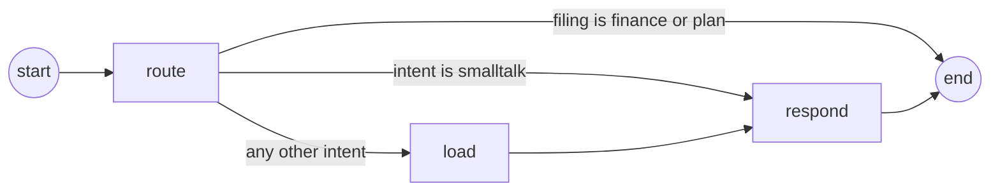

# The agent

The assistant runs on a small LangGraph graph with three nodes. It decides
whether a message is a question or a note to file. For a question, it decides
what you are asking about, fetches only the numbers that question needs, and
answers from them. It also records why it chose that route, so a misread
question is visible instead of silent.

## Rules

- **One message, one decision.** Every message gets exactly one intent, one
  period and one filing. You do not pick a command; the router does.
- **You see how your message was read.** The router writes a one-line reason in
  your language. The panel shows it as **Read as: …** while the answer is still
  being written: a question taken the wrong way is cheaper to rephrase than a
  wrong answer is to read.
- **A note is filed, not answered.** "hôm nay tiêu 30k" records money, so the
  run stops at the decision and the panel opens the Finance form with your text.
  "mai đi khám răng" opens the Goals & to-dos form. Nothing is saved until you
  confirm.
- **When in doubt, it is a question.** If a message could honestly be read both
  ways, the router answers it. An unwanted answer costs a sentence; an unwanted
  form costs the answer you came for. An unrecognised filing value from the
  model also counts as a question.
- **Money words win over review.** If you write about chi tiêu, tiền, spending,
  income or budget, the question is about money, even when you also name a week.
- **The dates come from your words, not the model's guess.** "tháng trước",
  "tuần trước nữa" and "tháng 9" are read by a regex. The router's period is
  used only when you named no stretch of time.
- **A greeting never touches the database, and neither does a how-to
  question.** `smalltalk` skips loading. `help` is answered from the app's
  built-in guide, not from your data.
- **The answer only uses what was loaded.** The responder never queries. What
  reached the model is exactly what is in the run's `context`, and you can read
  the run back to check.
- **Same days, never causes.** The answer may say that two things happened
  together and give the numbers. It may never say one caused, improved or led
  to another.
- **Thin data is called thin.** No trends read into three rows, no praise
  inflation, no scolding, and no medical, psychiatric or pharmacological
  advice. When nothing is logged for the stretch, the answer says so and asks
  what to look at.
- **An old conversation does not leak into a new question.** After 30 minutes
  of silence, earlier turns no longer count as context.
- **It replies in the language you wrote in:** natural Vietnamese for
  Vietnamese, not an English sentence with Vietnamese words in it.

## The graph

From `src/services/agent/graph.ts` and `src/services/agent/steps.ts`:

The branch is the decision, and the checkpoint records which branch a run took
next to the reason for choosing it. A note to file skips both the database and
the answer: there is no question, and an answer nobody reads is a model call
nobody needed. The graph is compiled once per process, because `compile()` is
not free and the checkpointer it closes over holds the connection pool.

## State

The state is defined in `src/services/agent/state.ts`. Each field has a reducer
that says how a node's update is merged.

| Field | Type | Merge | Holds |
| --- | --- | --- | --- |
| `messages` | `{ role: "user" \| "model", text, at }[]` | Appended | The conversation: the memory. `at` is an ISO timestamp the model never sees |
| `input` | string | Replaced | This turn's message |
| `userId` | string | Replaced | Whose data the run may read |
| `today` | `YYYY-MM-DD` | Replaced | Today in the caller's timezone |
| `decision` | `{ intent, period, filing, reason }` or null | Replaced | What the router decided |
| `context` | object or null | Replaced | What was loaded for this turn |
| `answer` | string | Replaced | This turn's answer, empty when the note was filed |
| `models` | string[] | Appended | Which model answered each step, such as `route:gemini-3.5-flash-lite` |

## route: what is this message?

`src/services/agent/nodes/route.ts` makes one cheap Gemini JSON call:
temperature 0, low thinking, a small schema, and 20 seconds per attempt. It runs
on every turn, so it must not be what makes the answer slow.

It is given three things:

- Today's date.
- The last four messages of the conversation in progress, so that "còn tháng
  trước thì sao" ("and last month?") is read against what was just asked.
- Your message.

**Filing** decides first whether the message is a question at all:

| Filing | Means | Examples from the prompt |
| --- | --- | --- |
| `finance` | You are telling it that money moved | "hôm nay tiêu 30k", "nhận lương 15tr", "đổ xăng 80 nghìn" |
| `plan` | You are telling it something to do, or a target to keep | "mai đi khám răng", "tuần này chạy 20km" |
| `none` | Everything else. Every question is `none` | "tháng này tiêu bao nhiêu" |

What usually separates a note from a question is a number with no question
around it: "tháng này tiêu 30k" is a note, "tháng này tiêu bao nhiêu" is a
question. Filing is a second axis, not another intent. `finance` as an intent
*asks* about money; `finance` as a filing *tells* the app that money moved.
There is no filing for the daily log, because the app has no form a note could
go into. When the message is filed, the intent and period are ignored.

**Intent**, for a question:

| Intent | Means | Examples from the prompt |
| --- | --- | --- |
| `review` | How a stretch of time went overall (energy, sleep, study, habits), not money | "tuần này thế nào", "tổng kết tháng", "tôi ngủ đủ chưa" |
| `plan` | Goals and things to do | "tuần tới làm gì", "mục tiêu của tôi đến đâu rồi", "còn việc gì chưa xong" |
| `finance` | Money in or out, including comparisons and day-by-day spend | "tháng này tiêu bao nhiêu", "so sánh chi tiêu tuần này với tuần trước" |
| `daily` | One day from the daily log, usually today or yesterday | "hôm nay tôi ghi gì", "hôm qua ngủ mấy tiếng" |
| `help` | How to use the app: where something is, how to do it, what a feature is for, whether the app can do something | "làm sao để ghi khoản chi", "thêm thói quen ở đâu", "khối thời gian là gì" |
| `smalltalk` | A greeting, a thank-you, anything that needs neither data nor instructions | — |

The line between `help` and the rest is what you are asking for, not the words.
"làm sao để" and "ở đâu" want instructions; "tôi đã" and "bao nhiêu" want your
own numbers. If you ask for both at once, the router chooses the instructions.

**Period** is the router's rough guess: `week`, `month`, or `recent`, the
default, which covers the last two weeks and is used for `daily`, `plan` and
`help`.

**Reason** is one short sentence in your language saying what the router
understood you to want. It is about you, never about "the system".

The model's answer is checked, not trusted:

- An unknown intent becomes `review`.
- An unknown period becomes `recent`.
- An unknown filing becomes `none`.
- The reason is cut to 300 characters.

Then a keyword check runs on your message, ignoring accents. If it is not a
filing and mentions chi tiêu, tiêu, tiền, lương, ngân sách, spending, expense,
income or budget, the intent becomes `finance`. Without this check, "so sánh
chi tiêu các ngày…" kept landing on `review`, which never opens the
transactions table, so the answer said there was no data.

## Which stretch of time

`src/lib/period.ts` reads the window from your message. Dates are arithmetic:
asked to do this itself, the model answered "tháng trước" with this month's
numbers. The patterns follow the app's `src/lib/reviews/period-phrase.ts`, and
matching ignores accents.

| You write | Window |
| --- | --- |
| "tháng này", "this month" | This calendar month |
| "tháng trước", "tháng rồi", "last month" | Last calendar month |
| "tháng trước nữa", "two months ago" | The month before that |
| "tháng 9", "month 9" | That month. If it is later in the year than today, last year's |
| "tuần này", "this week" | This week, Monday to Sunday |
| "tuần trước", "tuần qua", "last week" | Last week |
| "tuần trước nữa", "tuần kia", "two weeks ago" | The week before that |
| No stretch named | The router's period: this month, this week, or the last 14 days ending today |

The rules for matching:

- Months are checked before weeks.
- Longer phrases are checked before shorter ones inside them.
- "This" is checked before "last". In "tuần này với tuần trước", the window is
  this week, and last week is loaded as the comparison.

The **preceding window**, used for comparisons, steps back one calendar unit:
February before March, not the 31 days ending on the last day of February. A
`recent` window steps back by its own length.

## load: fetch only what was asked for

`src/services/agent/nodes/load.ts` writes nothing. See
[Data access](./data-access.md) for the queries.

| Intent | Loads into `context` |
| --- | --- |
| `review` | The `range`; daily-log aggregates for it (`current`); `comparedWith: { range, totals }` holding the same aggregates for the preceding window; up to 10 active goals |
| `plan` | The `range`, up to 20 active goals and up to 30 open to-dos |
| `finance` | The `range`; expense and income totals per category (`spend`, `income`); expense per day (`byDay`); `comparedWith: { range, spend, income, byDay }` for the preceding window. Transfers are excluded |
| `daily` | The `range` and up to 14 raw daily-log rows, newest first, because the question is about a specific day |
| `help` | `{ guide }`: the built-in guide. No window and no repository |
| `smalltalk` | Nothing. This node is skipped |

The comparison keeps its own dates inside `comparedWith`. When they were flat
sibling keys, the model once reported an empty August with July's dates
attached.

### The guide

`src/services/agent/guide.ts` is the app's manual, written as data and read off
the app's own screens, so a how-to question has a right answer rather than a
plausible one. It is written in English, and page names carry both labels
(`Habits / Thói quen`), so an answer can point at the words in the sidebar. It
is sent whole: picking topics by keyword would sometimes leave out the topic
that was needed.

It has 25 topics: overview, how the pages feed each other, daily log, your own
activities, home, habits, goals, timer, planned blocks, calendar, learning,
projects, finance, debts, health, journal, people, career, analytics, reviews,
quick capture, search, settings and offline. Each topic has a `body` (what the
thing is) and a `use` (a real occasion for reaching for it).

Tests in `tests/guide.test.ts` hold it to the app. For example, sessions
*replace* typed study minutes rather than adding to them, and there is no
bedtime field. The guide must be kept true: a guide that describes last month's
app is trusted just as much as a correct one, and answers with facts that have
moved.

## respond: answer from what was loaded

`src/services/agent/nodes/respond.ts` makes one streamed Gemini text call:
temperature 0.3, medium thinking, and 60 seconds per attempt. Each chunk is
passed to the `/api/chat/live` stream as a `delta` while it is being written.

The model is sent three things:

1. **A system prompt.** It shares a voice section: same language, short,
   GitHub-flavoured Markdown, lead with the answer, no administrative
   vocabulary (in Vietnamese, no *thực hiện*, *thao tác*, *tiến hành*, *vui
   lòng*, *biểu mẫu* or *hệ thống*). The rest depends on the intent:
   - **Data prompt**, for every intent except `help`. It carries the rules
     above. `range` is the exact window, and `comparedWith` is for contrast
     only. Numbers go inside the sentence that makes the claim, and JSON field
     names are never quoted.
   - **Help prompt**, for `help`. Answer only from the guide, and never invent a
     page, button, setting or limitation. If the guide does not cover the
     question, say so and point at the nearest page it does cover. Name a page
     in one language only, linked the first time it appears (for example
     `[Cài đặt](/settings)`). Say plainly what a feature cannot do. Never claim
     to know what you have logged. Remember that one person uses the app.
2. **The conversation in progress**, at most 12 messages. The checkpoint keeps
   all of it; this is only what gets replayed.
3. **Your message**, followed by `(You read this as: <reason>)` and the
   `context` JSON.

Only your plain message and the plain answer are added to `messages`, each with
its time. The JSON block is not kept, because re-injecting a stale block on
every later turn would crowd the thread and age badly.

## From a message to a reply or a form

What you see in the panel, end to end:

1. You type and press Enter. The panel shows *Reading the question…* at once.
2. The app's `/api/assistant` checks your rate limit, builds the thread id and
   opens `/api/chat/live`.
3. **route** decides. The reason arrives, and the panel shows **Read as: …**.
4. Then one of three things happens:
   - **A note to file.** A `file` event names `finance` or `plan`. The panel
     stops reading and leaves *That one goes in spending — here is the form.*
     (or *…in your plan…*) in the transcript. It then swaps itself for that
     form, with your text already read.
   - **A question.** The panel shows *Looking things up…* while **load** runs,
     then *Writing the answer…*. The answer bubble fills as `delta` chunks
     arrive, and the finished `answer` replaces it.
   - **Smalltalk.** The panel goes straight to *Writing the answer…*.
5. If your message contained an amount ("30k", "2 triệu", "100 nghìn"…), the
   answer offers **File as spending**, in case you meant it as a record.

## Threads and the checkpointer

After every node, LangGraph's `PostgresSaver` (`src/infra/checkpointer.ts`)
checkpoints the state, including the conversation, to Postgres under a
`thread_id`. A thread therefore survives a refresh, another device and a
redeploy.

- **Where it lives.** The same Neon database as the app, in its own `agent`
  schema, so its tables never collide with a Drizzle migration. `pnpm db:setup`
  creates it (see [Configuration](./configuration.md)).
- **One saver per process.** It holds a `pg.Pool`, and a pool per request
  would exhaust Neon's connection budget.
- **Thread ids.** The caller names the thread. A chat request without a
  `threadId` starts a new thread with a random UUID. The app names its threads
  `capture:<userId>:<opening>`, one per opening of the panel.
- **Lifetime in the app.** Each opening of the panel is a new conversation. An
  id nobody has written to is already empty, so the panel is ready the moment it
  is drawn. Closing the panel, or **Start over**, deletes the thread. A tab
  closed with the panel still open leaves its thread behind (never more than
  one), and the next opening deletes it: the id waits in `sessionStorage`.
- **Session gap.** `src/lib/session.ts` keeps only the trailing run of turns
  with no silence longer than 30 minutes, and nothing at all if the last turn is
  older than that. A turn with no timestamp counts as old. This protects a
  thread that runs for a long time: "còn tuần trước?" a week later is a new
  question, not a follow-up to a fortnight-old topic.
- **Cost.** Every node writes a checkpoint, so the service talks to the
  database far more than to the browser. That is why the function runs next to
  Neon. `pnpm bench` measures the cost.

The other AI features do not use threads. The review chat keeps its transcript
on screen and sends it with each turn, because a thread keyed only by period
would resume a month-old conversation the next time the panel opened.

## Gemini: the chain, keys and fallback

`src/services/gemini.ts` calls the Gemini interactions API
(`v1beta/interactions`) with plain `fetch`. It pins `Api-Revision: 2026-05-20`
so that a future API revision cannot reshape responses under a deployed build.
Answers are streamed with `?alt=sse`; only text from `model_output` steps is
kept, and thought steps are ignored.

**The chain is configuration, with nothing built in behind it.** `GEMINI_MODELS`
lists the models in order. `GEMINI_MODEL` is the same setting with one entry,
used only when `GEMINI_MODELS` is empty. A model id names a tier, a price and a
quota bucket, and a model shipped in a release months ago would be a choice
nobody made. With no model named, `/health` reports `gemini: not_configured`.
Use `GET /api/models` and `/api/models/check` to choose models (see
[API](./api.md)).

**Keys.** The service uses `GEMINI_API_KEY` plus every key in
`GEMINI_API_KEYS`, with duplicates removed. Quota is counted per project and
per model, so a second key from a second project is a second allowance, not a
spare.

One question walks a queue of (model, key) pairs: every key for the first
model, then every key for the next. The starting key rotates round-robin, so
consecutive questions do not all start on key one.

| What happens | Meaning | What the chain does |
| --- | --- | --- |
| `429` | That key's bucket for that model is empty | Cools that pair for `retry-after` (capped at 15 minutes) or one minute, and gives the next key the same model |
| `503` or `404` | The model is overloaded, or does not exist for this project | Skips the rest of that model's keys, cools the model for every key for `retry-after` or 30 seconds, and moves to the next model |
| Timeout | The model is not answering | Same as `503` |
| Empty answer | The model answered with no text | Same as `503` |
| Anything else | The request itself is wrong (including JSON that does not parse) | Stops. Rotating a malformed request through five keys only burns five keys |
| Failure after streaming began | Part of an answer has already reached you | Stops: another model cannot un-send it |

- **Cooling pairs and models are skipped.** If everything is cooling, the chain
  still asks once rather than refusing without trying: a cooldown is a guess,
  and someone is waiting.
- **The cooling map is per process.** It sets a floor under how often one
  question re-asks an empty bucket. It does not account for quota.
- **A budget caps the chain:** 40 seconds for routing and capture calls, 120
  seconds for answers. No new attempt starts after the budget runs out, which
  leaves room for the attempt in flight to finish inside its own timeout and
  within the function's `maxDuration`.

## Related

- [Overview](./overview.md) — what the service is and what leaves the machine
- [API](./api.md) — `/api/chat/live` and its events, `/api/chat/stream`, the threads routes
- [Data access](./data-access.md) — the queries behind each intent
- [Configuration](./configuration.md) — the model chain, keys, `db:setup` and `bench`
- [Operations](./operations.md) — what a failed run looks like
- [Assistant](../../features/assistant.md) — the panel this graph answers
- [Transactions](../../features/finance/transactions.md) — where a spending note is handed off
- [Goals](../../features/goals.md) — where a plan note is handed off
- [Reviews](../../features/reviews.md) — the review chat, which keeps no thread
- [Data model: daily log](../data-model/daily-log.md) — what `review` and `daily` read
- [Data model: habits and goals](../data-model/habits-and-goals.md) — what `review` and `plan` read
- [Data model: finance](../data-model/finance.md) — what `finance` reads
- [Data model: work and time](../data-model/work-and-time.md) — the to-dos `plan` reads
