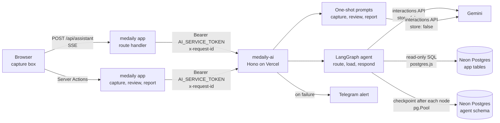

# AI service overview

`medaily-ai` is a separate deploy that owns every call the product makes to a
language model. The app gathers what it knows about you, sends it over, and
renders what comes back. The prompts, the Gemini keys, the chain of models and
the quota all live on the service side. It is a TypeScript service built on
Hono and LangGraph, runs on Vercel, and shares the app's Neon Postgres database.

| | |
| --- | --- |
| **Repository** | `medaily-ai`, separate from `medaily-frontend` |
| **Runtime** | Node 22+, Hono, LangGraph, Gemini over plain `fetch` |
| **Deployed on** | Vercel, Node runtime, region `iad1` |
| **Needs (app side)** | `AI_SERVICE_URL` and `AI_SERVICE_TOKEN`. See [Configuration](../../operations/configuration.md) |
| **Needs (service side)** | `DATABASE_URL`, a Gemini key, a model chain, `SERVICE_TOKEN`. See [Configuration](./configuration.md) |

> **Note:** These pages describe `medaily-ai` at `origin/main`, commit
> `1bc432d` (27 September 2026), which is the code the app calls.

## Rules

- **Nothing AI-powered exists without it.** If `AI_SERVICE_URL` or
  `AI_SERVICE_TOKEN` is unset in the app, the features that need the service
  are not offered at all, rather than shown broken. That means no Capture
  launcher, no `⌘J`, no assistant, no review chat and no written AI review.
  Every manual form keeps working.
- **The token never reaches a browser.** Every call goes out from a Server
  Action or a route handler (`/api/assistant`) on the app's server.
- **The service reads; it does not write the app's tables.** The only rows it
  owns are the assistant's conversation checkpoints, in their own `agent`
  schema. The app writes anything that ends up saved — a transaction, a goal, a
  to-do, a filed review — after you confirm it.
- **Only the assistant reads the database.** Quick capture, the review chat
  and the written review read nothing. Everything they need arrives in the
  request, sent by the app.
- **Every assistant query is scoped to one person.** Each repository filters
  on `user_id`, and the app supplies that id server-side.
- **Only what a question needs is fetched.** A router decides what you are
  asking about. A greeting or a how-to question never touches your data.
- **A note is filed, not answered.** When what you typed records something
  (spending, or a plan), the assistant stops at the decision and opens the form
  for it. Nothing is saved until you confirm there.
- **Nothing is kept on Google's side.** Every model request is sent with
  `store: false`.
- **A model's output is never trusted as data.** The router's decision is
  checked against fixed lists. Capture results are checked again by the app
  before a row is shown, and again before it is saved.

## Who calls it

All callers are on the app's server and use one client
(`src/server/services/ai-service.ts`, built on `src/server/service-client.ts`).

| Feature in the app | App code | Service route |
| --- | --- | --- |
| [Assistant](../../features/assistant.md), the capture box's chat | `src/app/api/assistant/route.ts`, `src/server/services/assistant.ts` | `POST /api/chat/live`, `DELETE /api/threads/:id` |
| Quick capture, finance ([Transactions](../../features/finance/transactions.md)) | `src/server/services/finance-capture.ts` | `POST /api/capture/finance` |
| Quick capture, goals and to-dos ([Goals](../../features/goals.md)) | `src/server/services/plan-capture.ts` | `POST /api/capture/plan` |
| Review chat ([Reviews](../../features/reviews.md)) | `src/server/services/review-chat.ts` | `POST /api/review/ask`, `POST /api/review/translate` |
| Written AI review ([Reviews](../../features/reviews.md)) | `src/server/services/ai.ts` | `POST /api/report/narrative` |

The review chat and the written review send the
[Dashboard](../../features/dashboard.md) insights along with the period's
aggregates, the same numbers that [Analytics](../../features/analytics.md) and
Reviews show. `GET /api/models`, `/api/models/check` and the debugging routes
`/api/chat` and `/api/chat/stream` are for operators. Nothing in the app calls
them.

## Architecture

Inside the service, dependencies point one way:
`http → services → repositories → infra`. Nothing under `src/services` knows it
is reached over HTTP, and nothing under `src/repositories` knows an agent is
asking.

| Folder | Holds |
| --- | --- |
| `src/config/` | Env parsing (`env.ts`), dotenv for local runs (`load-env.ts`) |
| `src/lib/` | Pure helpers: dates, period phrases, session gaps, rate limit, the IPv6 connect fix, logging, request ids, alert redaction and gating |
| `src/infra/` | Connections out: the postgres.js client (`db.ts`) and the checkpointer pool (`checkpointer.ts`) |
| `src/repositories/` | Read-only data access, one list method per entity with a filter |
| `src/services/` | The Gemini client, the model listing, Telegram alerts, the capture, review and report prompts, and the agent graph under `services/agent` |
| `src/http/` | Transport: app, middleware (request id, rate limit, token), routes |
| `api/index.ts` | The Vercel entry point |
| `tests/` | Vitest: the Gemini chain, the guide, period phrases, session gaps, rate limits, steps |

## Why it is a separate service

The app's AI used to answer one message at a time. Memory lived in React state,
so a refresh lost the conversation. There was no routing either: you picked
`/finance`, `/plan` or `/review` yourself, and a `switch` dispatched it.

In `medaily-ai`, a router node makes that decision and records why. LangGraph's
checkpointer keeps the thread in Postgres, so a conversation survives a
refresh, another device and a redeploy. Keeping the service a separate deploy
also lets it scale on its own, and puts every prompt and every quota in one
place: you edit a prompt once, and quota comes out of one bucket.

## Deployment

- Vercel, Node runtime, one region: `vercel.json` pins `iad1`. It is not Edge,
  because the checkpointer speaks the Postgres wire protocol.
- `maxDuration: 300` on `api/index.ts`. That is the Hobby plan's ceiling, about
  ten times what a run needs.
- `vercel.json` rewrites every path to `/api`, so the Hono app sees the original
  URL and routes it itself.
- The function sits next to Neon (`us-east-2`), not next to the people using
  it. The graph writes a checkpoint after every node, so it talks to the
  database far more than to the browser.

[Configuration](./configuration.md) has the build details and the two settings
the Node runtime forces.

## What data it can read

Only the assistant reads the app's tables, through five read-only
repositories. Every query is filtered by `user_id`.
[Data access](./data-access.md) has the columns.

| Data | Table | Read when you ask about |
| --- | --- | --- |
| Daily logs: scores, sleep, minutes, win, problem and priority text | `daily_logs` | A period (`review`) or a day (`daily`) |
| Goals | `goals` | A period (`review`) or plans (`plan`) |
| Open to-dos | `project_tasks` | Plans (`plan`) |
| Spending and income, per category and per day | `transactions`, `finance_categories` | Money (`finance`) |
| The first user id | `users` | Defined, but nothing calls it |

The service is **read-only** against the app's tables. No repository contains
an `insert`, `update` or `delete`. It does write to its own tables: the
LangGraph checkpointer creates and fills them in the `agent` schema, and
`DELETE /api/threads/:id` removes a thread from them.

> **Note:** The database connection itself is not read-only. The service uses
> the same `DATABASE_URL` as the app, with the same rights. The read-only
> guarantee comes from the code, not from a database role.

## Privacy

What leaves the machine on each call:

- **Assistant.** Your message, your user id, your timezone and the thread id.
  The service reads only the rows the routed question needs and sends their
  numbers to Gemini, together with the turns of the current conversation (at
  most 12, and none older than a 30-minute silence). A how-to question sends
  the app's built-in guide instead of your data.
- **Quick capture, finance.** The sentence you typed, today's date, your
  currency code, and the names (and optional notes) of your own categories. No
  balances, no history, no ids.
- **Quick capture, goals and to-dos.** The text you typed and today's date. No
  existing goals or tasks.
- **Written AI review.** Period aggregates for this period and the one before,
  plus the rule-generated observations. No notes, no journal entries, no names.
- **Review chat.** The same aggregates and observations, plus the lines you
  wrote in that period's daily logs (wins, problems, lesson titles) and the
  transcript on screen. Journal entries, notes and other people's names stay on
  the machine.

On the service side:

- Every Gemini request sets `store: false`. No interaction is kept open, so
  earlier turns are sent again rather than resumed.
- The assistant's conversation is stored in the `agent` schema of the same
  database, keyed by thread id, until the panel deletes it. The capture, review
  and report routes store nothing.
- Alerts to Telegram are redacted before they leave (see
  [Operations](./operations.md)). They never carry your message text, only the
  error, the request id and the thread id.

## Related

- [API](./api.md) — every endpoint, with auth and request and response shapes
- [The agent](./agent.md) — how a question becomes an answer or a hand-off to a form
- [Data access](./data-access.md) — which tables each repository reads
- [Configuration](./configuration.md) — env vars, setup scripts, running and deploying
- [Operations](./operations.md) — logs, request ids, alerts and failure modes
- [Assistant](../../features/assistant.md) — the capture box and `⌘J`, the main caller
- [Reviews](../../features/reviews.md) — the written AI review and the review chat
- [Transactions](../../features/finance/transactions.md) — quick capture drafts transactions for you to confirm
- [Goals](../../features/goals.md) — quick capture drafts goals and to-dos
- [Dashboard](../../features/dashboard.md) — its insights go with every review request
- [Analytics](../../features/analytics.md) — the same period aggregates
- [App configuration](../../operations/configuration.md) — `AI_SERVICE_URL` and `AI_SERVICE_TOKEN`
- [Data model: reviews and insights](../data-model/reviews-and-insights.md) — `ai_reports`, where the app files what the service wrote
