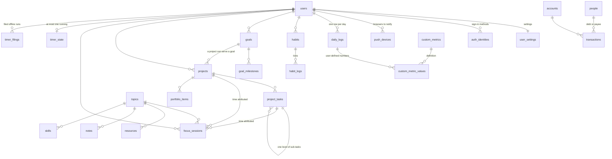

# Data model

medaily keeps almost everything in PostgreSQL, puts two append-heavy logs in MongoDB, and uses Firestore only as a content-free signal for live updates. This page covers what all three have in common: the conventions that repeat on almost every table, the map of how the main tables relate, and how the schema reaches a database. Each domain has its own page with the column tables.

## Three stores

| Store | What lives there | Reached through |
| --- | --- | --- |
| PostgreSQL | 47 tables and two views — everything relational | `DATABASE_URL`, Drizzle |
| MongoDB | The [activity trail](./activity-trail.md) and [chat](./chat.md) | `MONGODB_URI`, optional |
| Firestore | One small document per chat room (a counter and a time) and short-lived typing claims. No message text, no roster, no membership | The browser only — see [Live updates](../realtime/overview.md) |

## PostgreSQL

PostgreSQL holds 47 tables and two views, with one Drizzle schema file per module under `src/lib/db/schema/`.

### Migrations and `drizzle/views.sql`

Migrations live in `drizzle/` and are applied with `pnpm db:migrate` — never automatically, and never after the code that needs them (see the deploy rule in `CLAUDE.md`).

`scripts/migrate.ts` runs the numbered migrations first and then re-applies `drizzle/views.sql` on every run. That file is idempotent and holds what a migration cannot express well, or what has to exist after every migration:

- the two views, [`v_daily_effective`](./daily-log.md) and [`v_account_balances`](./finance.md)
- the `updated_at` trigger (`set_updated_at()`) and the search triggers that maintain `search_tsv` (see [Learning and knowledge](./learning-and-knowledge.md))
- the `unaccent` extension
- the owner row (see [`users`](./core.md))

Migration numbers such as `0017` are cited beside the columns they added on each domain page.

### Conventions

These repeat on almost every table and are not described again on the domain pages.

| Column | Meaning |
| --- | --- |
| `id` | `uuid`, primary key, `gen_random_uuid()` |
| `user_id` | `uuid` → `users.id`, `ON DELETE CASCADE`. **Every repository query filters on it.** Deleting the user deletes everything they own |
| `created_at` / `updated_at` | `timestamptz`, default `now()`. `updated_at` is kept by a `BEFORE UPDATE` trigger (`set_updated_at()`, installed by `drizzle/views.sql` on every table that has the column), so a write that forgets it is still stamped. Some repositories also set it explicitly; the trigger wins either way |
| `archived_at` | `timestamptz` nullable. Non-null means hidden from lists but still joinable, so history stays readable. Rows are archived, not deleted |
| `note` / `notes` | free text the user writes; never parsed |
| `sort_order` | `integer`, manual ordering inside a list |

Dates use `date` (no timezone) for anything the user thinks of as a day, and `timestamptz` for machine instants. The difference matters: the app has a configurable **day rollover hour** (`user_settings.day_rollover_hour`, see [Core](./core.md)), so "today" is not midnight.

### Map

Finance, health, knowledge, people, career and reviews hang off `users` the same way and are shown on their own pages.

## MongoDB

Not everything is in Postgres. The **activity trail** and **chat** live in MongoDB, reached through `MONGODB_URI`. Leave it blank and neither is offered: no driver connects, and the pages are not there to click.

Why a second store at all: both are append-heavy logs of things that happened, neither joins against the relational schema, and the trail expires on its own. Neither has a migration file — collections and indexes are created on first use by `readyCollection`, so there is nothing to run before a deploy.

**No transactions anywhere in here.** Mongo has them, but they need a replica set and the mongod the integration tests run against is standalone — code that works on Atlas and fails in CI is the worst kind. Every write is idempotent by key instead, so a retry is always safe and an interrupted sequence leaves something harmless rather than something wrong.

## Firestore

Firestore is not a database of record here. It holds one document per chat room, named by the room's `doorbellKey`, with a counter and a time, plus one typing claim per person typing. What that amounts to — and why the text itself never goes there — is in [What Firestore ends up holding](../realtime/overview.md).

## Pages in this section

| Page | Tables |
| --- | --- |
| [Core](./core.md) | `users`, `user_settings`, `auth_identities`, `push_devices` |
| [The daily log](./daily-log.md) | `daily_logs`, `custom_metrics`, `custom_metric_values`, `v_daily_effective` |
| [Habits and goals](./habits-and-goals.md) | `habits`, `habit_logs`, `goals`, `goal_milestones` |
| [Work and time](./work-and-time.md) | `projects`, `project_tasks`, `focus_sessions`, `timer_state`, `timer_filings`, `planned_blocks`, `events`, `reminders` |
| [Learning and knowledge](./learning-and-knowledge.md) | `topics`, `resources`, `notes`, `note_links`, `tags`, `note_tags`, `journal_entries` |
| [Finance](./finance.md) | `accounts`, `finance_categories`, `transactions`, `recurring_transactions`, `budgets`, `assets`, `investments`, `v_account_balances` |
| [Health](./health.md) | `workouts`, `workout_sets`, `body_measurements`, `nutrition_logs` |
| [People](./people.md) | `people`, `interactions`, `person_photos` |
| [Career](./career.md) | `skills`, `achievements`, `portfolio_items` |
| [Reviews and generated output](./reviews-and-insights.md) | `weekly_reviews`, `monthly_reviews`, `yearly_reviews`, `insights`, `ai_reports` |
| [Activity trail](./activity-trail.md) | Mongo `activity` |
| [Chat](./chat.md) | Mongo `chat_rooms`, `chat_members`, `chat_messages`, `chat_invites` |

## Related

- [Live updates](../realtime/overview.md) — how Firestore is used alongside these stores
- [Configuration](../../operations/configuration.md) — `DATABASE_URL`, `MONGODB_URI` and the other variables that switch stores on
- [Scheduled jobs](../../operations/scheduled-jobs.md) — the nightly job that works over these tables
